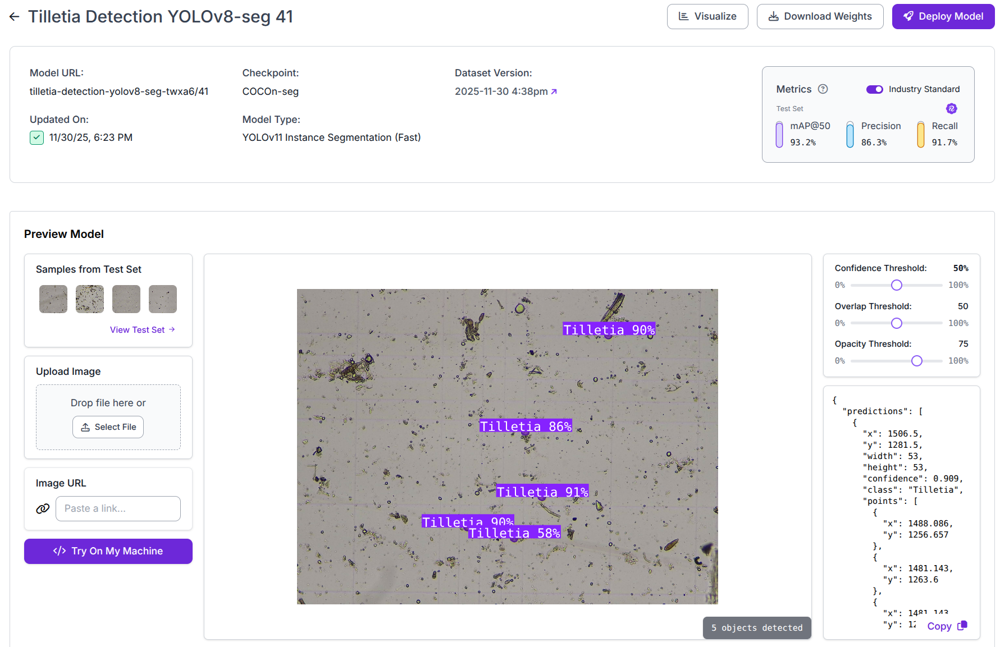

# Setup step
REPO_DIR is the directory where the github repository is cloned
```
export REPO_DIR=<insert path to cloned repository here>
```

# Production autostart (systemd)
Use deployment scripts from `app/deploy` to install a system-wide service.

Install and start service (builds images and enables systemd unit):
```
cd ${REPO_DIR}/deploy
sudo ./install-autostart.sh
```

Optional: manual service control:
```
sudo systemctl status tilletia-app.service
sudo systemctl restart tilletia-app.service
sudo systemctl stop tilletia-app.service
```

Uninstall system service only (keeps all data and configs):
```
cd ${REPO_DIR}/deploy
sudo ./install-autostart.sh --uninstall
```

Optional: Logs:
```
sudo journalctl -u tilletia-app.service -f
```

Optional: Run stack without installing service:
```
cd ${REPO_DIR}/deploy
./start.sh
```
This mode mounts models from `${REPO_DIR}/data/model`, and uses `${REPO_DIR}/data/output_hq` and `${REPO_DIR}/data/runs` for outputs.
Missing runtime folders under `data/` are created automatically by deploy scripts.

# Development tips&tricks

On the very first run build docker image with all dependencies:
```
cd ${REPO_DIR}/docker
docker build -t opencv-gst:latest -f Dockerfile.desktop .
```

Optional: test the docker image by trying to compile as tensorrt the pre-trained ultralytics yolon model. You should see `TensorRT: export success ✅ 200.1s, saved as 'yolo11n.engine' (11.9 MB)` at the end:
```
docker run --network host --runtime=nvidia --rm -it -e NVIDIA_DRIVER_CAPABILITIES=all -v $(pwd):/app opencv-gst:latest yolo export format=engine
```

Ensure NVIDIA Container Toolkit is installed on the host if you run Docker with GPU acceleration.

# How to compile YOLO-model
Model must be compiled as tensorrt (once new model is added). Ultralytics models are stored in `data/model/ul` and Roboflow models in `data/model/rf`.

1. Download the model - open model card from the list and choose `Download Weights` button

2. By default model is downloaded as `weights.pt`, rename it to the meaningful name, for example `yolo11-tilletia-detection-yolov8-seg-twxa6-41-fp16.pt` would be good to track the model type and origin from the app. The postfix `tilletia-detection-yolov8-seg-twxa6-41` is based on `Model URL` on the screenshot on previous step. `-fp16` is essential at the end of the filename to let the application find the model.
3. Copy the renamed model to the folder `${REPO_DIR}/data/model/ul/`

4. Compile the model to tensorrt
```
cd ${REPO_DIR}
docker run --network host --runtime=nvidia --rm -it -e NVIDIA_DRIVER_CAPABILITIES=all -v "$(pwd)/data/model:/app/model" opencv-gst:latest yolo export format=engine model=/app/model/ul/yolo11-tilletia-detection-yolov8-seg-twxa6-41-fp16.pt imgsz=640 half
```

To convert Roboflow RF-DETR object detection models:
```
cd ${REPO_DIR}
docker run --runtime nvidia --rm -it --entrypoint python3 -v "$(pwd)/src:/app" -v "$(pwd)/data/model:/app/model" export-rf /app/convert.py
```

# How to Run Application
Run mediamtx docker container (stop and remove if it's running)
```
cd ${REPO_DIR}
docker run --rm -d --name mediamtx --network host -v "$(pwd)/config/mediamtx.yml:/mediamtx.yml:ro" bluenviron/mediamtx:latest
```

Run app
```
cd ${REPO_DIR}
docker run --network host --runtime=nvidia --rm -it --device=/dev/video0 \
  -v "$(pwd)/src:/app" \
  -v "$(pwd)/data/model:/app/model" \
  -v "$(pwd)/data/output_hq:/app/output_hq" \
  -v "$(pwd)/data/runs:/app/runs" \
  opencv-gst:latest python /app/app.py
```


# How to Update the API readme file
Run application as described in previous section and execute
```
cd ${REPO_DIR}
curl http://localhost:8000/apispec_1.json > auto_swagger.json
python3 generate_docs.py
```
